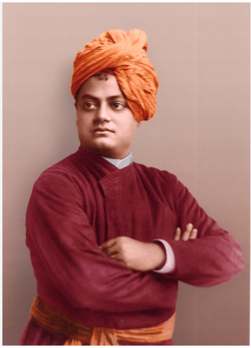

# beamercolortheme-chicago1893

 ?label=chicago&labelColor=rgb(128%2C%200%2C%200))

**Colortheme for Beamer (LaTeX) inspired by Swami Vivekananda's attire while in Chicago during September 1893.**

Like his teachings, his attire had been an incredible fusion of the East and the West, and its color depicting his burning commitment for the cause.
## Use
- Download from  Repository [<kbd> Click here </kbd>](https://github.com/anamitro/beamercolortheme-chicago1893)
- Download and save the .sty file in the directory where your .tex file is saved,
- Alternatively, for  Linux-based distros if you're using Texlive, save the file with root permission in /usr/share/texlive/texmf-dist/tex/latex/beamercolortheme-chicago1893
  
  > $ cd /usr/share/texlive/texmf-dist/tex/latex
  >
  > $ mkdir beamercolortheme-chicago1893
  >
  > $ cd /usr/share/texlive/texmf-dist/tex/latex/beamercolortheme-chicago1893
  
-  Write in your .tex file
  
  > \usecolortheme{chicago1893}
  
  before

  > \begin{document}

[**AN EXAMPLE**](https://anamitro.github.io/files/talks/crest_anamitro_davenport_r.pdf)

## Read more about the pioneer of Indian Renaissance:
[https://belurmath.org/swami-vivekananda/](https://belurmath.org/swami-vivekananda/)

___________

Made by [Anamitro Biswas](https://anamitro.github.io). For suggestions, email anamitroappu@gmail.com. GPL 2.0.

